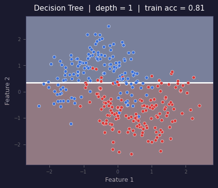

# neural-trees

**sklearn-compatible implementations of classic ML algorithms from research papers — the ones that never got a proper open-source home.**

[](https://pypi.org/project/neural-trees/)
[](https://www.python.org/downloads/)
[](LICENSE)
[](https://github.com/cgrtml/neural-trees/actions)

---



*Decision boundary learning with Soft Decision Trees (toy dataset)*

---

## Install

```bash
pip install neural-trees
```

## Quick Start

```python
from neural_trees import SoftDecisionTree
from sklearn.datasets import load_iris
from sklearn.model_selection import train_test_split

X, y = load_iris(return_X_y=True)
X_train, X_test, y_train, y_test = train_test_split(X, y, random_state=42)

model = SoftDecisionTree(depth=4, max_epochs=40)
model.fit(X_train, y_train)
print(model.score(X_test, y_test))  # 0.97
```

Works in any sklearn Pipeline:

```python
from sklearn.pipeline import Pipeline
from sklearn.preprocessing import StandardScaler

pipe = Pipeline([
    ("scaler", StandardScaler()),
    ("model", SoftDecisionTree(depth=4, max_epochs=40)),
])
pipe.fit(X_train, y_train)
pipe.score(X_test, y_test)
```

---

## Benchmark

5-fold CV accuracy on standard datasets (with `StandardScaler`):

| Model | Iris | Wine | Breast Cancer |
|-------|:----:|:----:|:-------------:|
| **Soft Decision Tree** (depth=4) | **0.96** | **0.95** | **0.95** |
| CART (sklearn) | 0.953 | 0.865 | 0.917 |
| Random Forest | 0.967 | 0.978 | 0.956 |
| SVM (RBF) | 0.967 | 0.983 | 0.974 |

Soft Decision Trees close much of the gap between CART and ensemble/kernel methods while remaining fully differentiable and interpretable.

---

## Algorithms

Based on implementations inspired by academic research, including works by Prof. Dr. Ethem Alpaydın (*Introduction to Machine Learning*, MIT Press).

| Algorithm | Paper |
|-----------|-------|
| **Soft Decision Trees** | İrsoy, Yıldız, Alpaydın (ICPR 2012) |
| **Omnivariate Decision Trees** | Yıldız & Alpaydın (IEEE TNN 2001) |
| **Hierarchical Mixture of Experts + Dropout** | İrsoy & Alpaydın (Neurocomputing 2021) |
| **GAL: Grow and Learn Networks** | Alpaydın (IJPRAI 1994) |
| **Combined 5×2cv F Test** | Alpaydın (Neural Computation 1999) |
| **McNemar's Test + Paired t-test** | — |
| **Naive Bayes, Weighted KNN** | Textbook Ch. 3–8 |

---

## Use Cases

**Research** — reproduce or extend results from the original papers with a clean, tested codebase.

**Model comparison** — statistically rigorous classifier comparison. The standard paired t-test is unreliable when training folds overlap; Alpaydın's 5×2cv F test fixes that.

```python
from neural_trees import combined_5x2cv_f_test
from sklearn.svm import SVC
from sklearn.tree import DecisionTreeClassifier
from sklearn.datasets import load_breast_cancer

X, y = load_breast_cancer(return_X_y=True)
result = combined_5x2cv_f_test(DecisionTreeClassifier(), SVC(kernel="rbf"), X, y)
print(result)
```

```
StatisticalTestResult(
  test       = Alpaydın's Combined 5×2cv F Test
  statistic  = 12.4731
  p-value    = 0.0083
  decision   = ✓ REJECT H0
)
```

**Education** — understand how soft splits and mixture-of-experts work from the inside, not just the textbook diagram.

---

## Why?

I was reading through Alpaydın's papers and kept hitting the same wall: interesting algorithms, no usable Python code anywhere. The Soft Decision Tree paper (ICPR 2012) alone has hundreds of citations but the implementations floating around are incomplete, undocumented, or years out of date.

So I wrote them myself — clean, tested, and fully compatible with the sklearn API.

---

## Notebooks

- [`01_soft_decision_trees.ipynb`](notebooks/01_soft_decision_trees.ipynb) — training, boundary visualization, comparison with CART
- [`02_classifier_comparison_tests.ipynb`](notebooks/02_classifier_comparison_tests.ipynb) — when to use which statistical test

---

## Citation

If you use this in academic work, please cite the original papers:

```bibtex
@inproceedings{irsoy2012soft,
  title     = {Soft Decision Trees},
  author    = {\.{I}rsoy, O{\u{g}}uzhan and Y{\i}ld{\i}z, Olcay Taner and Alpayd{\i}n, Ethem},
  booktitle = {ICPR},
  year      = {2012}
}

@article{alpaydin1999combined,
  title   = {Combined 5x2cv {F} Test for Comparing Supervised Classification Learning Algorithms},
  author  = {Alpayd{\i}n, Ethem},
  journal = {Neural Computation},
  volume  = {11},
  number  = {8},
  pages   = {1885--1892},
  year    = {1999}
}
```

---

## License

MIT — see [LICENSE](LICENSE).
