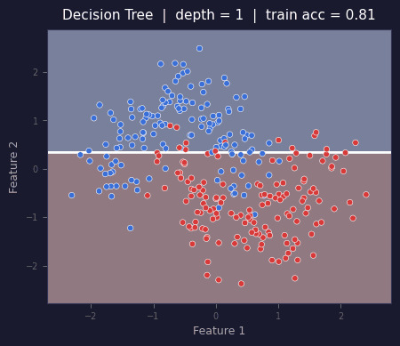

# neural-trees

[](https://pypi.org/project/neural-trees/)

Soft decision trees, mixture of experts, and statistical model comparison tests for Python. A scikit-learn compatible library implementing classic machine learning algorithms from research papers, with a PyTorch backend.

<p align="center">
  
</p>

<p align="center">
Decision boundary learning with Soft Decision Trees on a toy dataset.
</p>

[](https://pypi.org/project/neural-trees/)
[](https://pepy.tech/projects/neural-trees)
[](https://www.python.org/downloads/)
[](LICENSE)
[](https://github.com/cgrtml/neural-trees/actions)
[](https://github.com/cgrtml/neural-trees/stargazers)

## Features

- scikit-learn compatible API (`fit`, `predict`, `score`, works in `Pipeline`)
- PyTorch backend with GPU support (`device="auto"` picks CUDA, then Apple silicon MPS, then CPU)
- Torch imported lazily, so the numpy-only half of the library works without it
- Soft Decision Trees, Hierarchical Mixture of Experts, Multivariate and Omnivariate Trees, GAL
- Combined 5x2cv F test, McNemar's test, paired t-test for classifier comparison
- Tested on standard benchmarks (Iris, Wine, Breast Cancer)

## Installation

```bash
pip install neural-trees
```

PyTorch comes with it and backs `SoftDecisionTree`, `HierarchicalMixtureOfExperts`
and `GALNetwork`. It is imported lazily, so in an environment where torch cannot
be installed at all, a browser running Pyodide being the case that prompted
this, the rest of the library still works:
`MultivariateDecisionTree`, `OmnivariateDecisionTree`, `WeightedKNN`,
`NaiveBayesClassifier`, the two hard exports and the comparison tests. Touching
a torch-backed estimator there raises an error naming `pip install torch`
rather than failing at import.

### Install from source

```bash
git clone https://github.com/cgrtml/neural-trees.git
cd neural-trees
pip install -e .
```

## Quick Start

Train a Soft Decision Tree on the Iris dataset:

```python
from neural_trees import SoftDecisionTree
from sklearn.datasets import load_iris
from sklearn.model_selection import train_test_split

X, y = load_iris(return_X_y=True)
X_train, X_test, y_train, y_test = train_test_split(X, y, random_state=42)

model = SoftDecisionTree(depth=4, max_epochs=40)
model.fit(X_train, y_train)
print(model.score(X_test, y_test))  # ~0.97
```

Use it inside a scikit-learn pipeline:

```python
from sklearn.pipeline import Pipeline
from sklearn.preprocessing import StandardScaler

pipe = Pipeline([
    ("scaler", StandardScaler()),
    ("model", SoftDecisionTree(depth=4, max_epochs=40)),
])
pipe.fit(X_train, y_train)
pipe.score(X_test, y_test)
```

## Interactive playground

[`app.py`](app.py) is a Streamlit dashboard for comparing the models side by
side on standard and synthetic datasets, with live decision boundaries and
hyperparameter controls:

```bash
pip install -r requirements.txt
streamlit run app.py
```

The same file is what [Streamlit Community
Cloud](https://streamlit.io/cloud) installs, so the hosted version and the
local one run the same code.

## Benchmark

5-fold stratified cross-validation accuracy with `StandardScaler` preprocessing,
averaged over 5 seeds. Every number comes from
[`benchmarks/run_benchmarks.py`](benchmarks/run_benchmarks.py), so the table can
be re-run and checked:

```bash
python benchmarks/run_benchmarks.py --seeds 5
```

| Model | Iris | Wine | Breast Cancer |
|-------|:----:|:----:|:-------------:|
| **Soft Decision Tree** (depth=4) | 0.900 | 0.979 | 0.976 |
| **Multivariate Tree** (depth=3) | 0.973 | 0.989 | 0.952 |
| **Hierarchical MoE** (depth=2) | 0.904 | 0.979 | 0.977 |
| **GAL Network** | 0.951 | 0.980 | 0.978 |
| CART (sklearn) | 0.943 | 0.917 | 0.920 |
| Random Forest | 0.945 | 0.980 | 0.960 |
| SVM (RBF) | 0.959 | 0.984 | 0.978 |

On Wine and Breast Cancer every model here beats CART by five points or more,
and the mixture of experts and GAL land within noise of Random Forest and SVM.

Iris is the honest counterexample. The two depth-based tree models sit *below*
CART there (0.900 and 0.904 against 0.943): 150 samples over 3 classes is too
little data for a depth-4 tree with 15 gates trained for 40 epochs, and a single
oblique split does better. `growth="incremental"` lets a soft tree choose its own
depth against a validation split rather than being handed one. This is also why
the comparison scripts in [`examples/`](examples) use a hypothesis test rather
than a single accuracy number.

## Algorithms

These implementations start from the published algorithms below and depart
from them where this library makes its own design choices. Where an
implementation deviates deliberately, the module docstring says so. Treat the
references as the lineage of an idea, not as a claim of exact reproduction.

| Algorithm | Reference |
|-----------|-----------|
| **Soft Decision Trees** | İrsoy, Yıldız, Alpaydın (ICPR 2012) |
| **Hard export of a soft tree** | `to_hard_tree()`, this library |
| **Hard routing export of a mixture** | `to_hard_router()`, this library |
| **Multivariate Decision Trees** | Alpaydın & Çetin (1995), Yıldız & Alpaydın (IEEE TNN 2001) |
| **Omnivariate Decision Trees** | Yıldız & Alpaydın (IEEE TNN 2001) |
| **Hierarchical Mixture of Experts with subtree dropout** | İrsoy & Alpaydın (Neurocomputing 2021) |
| **GAL: Grow and Learn Networks** | Alpaydın (IJPRAI 1994) |
| **Combined 5x2cv F Test** | Alpaydın (Neural Computation 1999) |
| **McNemar's Test, Paired t-test** | Standard references |
| **Naive Bayes, Weighted KNN** | Textbook chapters 3 to 8 |

## Use Cases

**Research.** Reproduce or extend results from the original papers with a clean, tested codebase.

**Statistical model comparison.** Compare classifiers with proper hypothesis tests instead of ad hoc accuracy diffs:

```python
from neural_trees import combined_5x2cv_f_test
from sklearn.svm import SVC
from sklearn.tree import DecisionTreeClassifier
from sklearn.datasets import load_breast_cancer

X, y = load_breast_cancer(return_X_y=True)

result = combined_5x2cv_f_test(
    DecisionTreeClassifier(),
    SVC(kernel="rbf"),
    X, y,
)

print(result)
```

**Education.** A working reference for soft splits and mixtures of experts beyond textbook diagrams.

## Why Soft Decision Trees

Standard decision trees use hard splits, which makes them non-differentiable and unstable to small input changes. Soft Decision Trees replace each split with a sigmoid gate, which means:

- The tree is fully differentiable and trains with gradient descent
- Predictions are smooth, not piecewise constant
- Performance often lands between CART and ensemble methods
- The tree stays interpretable, you can still read off split decisions

## Examples

Runnable scripts in [`examples/`](examples):

| Script | What it shows |
|--------|---------------|
| [`01_iris_classification.py`](examples/01_iris_classification.py) | Minimal train/test loop on Iris |
| [`02_pipeline_with_scaler.py`](examples/02_pipeline_with_scaler.py) | `StandardScaler` + `SoftDecisionTree` in a `Pipeline`, 5-fold CV |
| [`03_classifier_comparison.py`](examples/03_classifier_comparison.py) | Combined 5x2cv F test against CART |
| [`04_decision_boundary.py`](examples/04_decision_boundary.py) | Decision boundary plot on `make_moons` |

```bash
python examples/01_iris_classification.py
```

## Notebooks

[](https://colab.research.google.com/github/cgrtml/neural-trees/blob/main/notebooks/01_soft_decision_trees.ipynb)
[](https://colab.research.google.com/github/cgrtml/neural-trees/blob/main/notebooks/02_classifier_comparison_tests.ipynb)
[](https://colab.research.google.com/github/cgrtml/neural-trees/blob/main/notebooks/03_multivariate_decision_trees.ipynb)

- [`01_soft_decision_trees.ipynb`](notebooks/01_soft_decision_trees.ipynb): training, decision boundary visualization, comparison with CART
- [`02_classifier_comparison_tests.ipynb`](notebooks/02_classifier_comparison_tests.ipynb): when to use which statistical test
- [`03_multivariate_decision_trees.ipynb`](notebooks/03_multivariate_decision_trees.ipynb): oblique splits against CART and soft trees

## What is original here

The algorithms below come from published work. What this library adds on top
of them, and what the `@software` entry in the next section is for:

- **Four models that did not work.** `HierarchicalMixtureOfExperts` could not
  take a single gradient step, `OmnivariateDecisionTree` returned the same leaf
  for every input, `GALNetwork` scored at chance on separable data, and
  condensed nearest neighbour produced an inconsistent prototype set. Each was
  diagnosed, fixed, and covered by a regression test that fails against the old
  code.
- **Design choices the papers do not make**, each measured rather than assumed:
  residual-fitted units for GAL, growth decided on held-out error rather than a
  fixed threshold, per-leaf growth for soft trees, and a temperature on the
  soft gates that is off by default because the effect is mixed.
- **Hard exports.** `to_hard_tree()` and `to_hard_router()` turn a trained soft
  model into plain numpy with readable rules, and report how often the export
  agrees with the model it came from instead of assuming it does.
- **A library around the algorithms**: one scikit-learn API across seven
  classifiers, `sample_weight` and `class_weight` throughout, `check_estimator`
  clean, 255 tests, and a benchmark table generated by a script in the repo
  rather than typed by hand.

Where an implementation deviates from its source deliberately, the module
docstring says so and gives the numbers.

## Citation

**To cite this library**, which is the software described above:

```bibtex
@software{temel_neural_trees,
  author = {Temel, Cagri},
  title  = {neural-trees: scikit-learn compatible soft decision trees,
            mixtures of experts and classifier comparison tests},
  year   = {2026},
  url    = {https://github.com/cgrtml/neural-trees}
}
```

GitHub's "Cite this repository" button reads
[`CITATION.cff`](CITATION.cff), which carries the same information.

**If you use one of the underlying algorithms**, cite its source as well. These
are the lineage of the ideas, not co-authorship of this implementation:

```bibtex
@inproceedings{irsoy2012soft,
  title     = {Soft Decision Trees},
  author    = {\.{I}rsoy, O{\u{g}}uzhan and Y{\i}ld{\i}z, Olcay Taner and Alpayd{\i}n, Ethem},
  booktitle = {ICPR},
  year      = {2012}
}

@article{irsoy2021dropout,
  title   = {Dropout Regularization in Hierarchical Mixture of Experts},
  author  = {\.{I}rsoy, O{\u{g}}uzhan and Alpayd{\i}n, Ethem},
  journal = {Neurocomputing},
  volume  = {419},
  pages   = {148--156},
  year    = {2021}
}

@article{yildiz2001omnivariate,
  title   = {Omnivariate Decision Trees},
  author  = {Y{\i}ld{\i}z, Olcay Taner and Alpayd{\i}n, Ethem},
  journal = {IEEE Transactions on Neural Networks},
  volume  = {12},
  number  = {6},
  pages   = {1539--1546},
  year    = {2001}
}

@article{alpaydin1994gal,
  title   = {GAL: Networks that Grow when they Learn and Shrink when they Forget},
  author  = {Alpayd{\i}n, Ethem},
  journal = {International Journal of Pattern Recognition and Artificial Intelligence},
  volume  = {8},
  pages   = {391--414},
  year    = {1994}
}

@article{alpaydin1997voting,
  title   = {Voting over Multiple Condensed Nearest Neighbors},
  author  = {Alpayd{\i}n, Ethem},
  journal = {Artificial Intelligence Review},
  volume  = {11},
  pages   = {115--132},
  year    = {1997}
}

@article{alpaydin1999combined,
  title   = {Combined 5x2cv {F} Test for Comparing Supervised Classification Learning Algorithms},
  author  = {Alpayd{\i}n, Ethem},
  journal = {Neural Computation},
  volume  = {11},
  number  = {8},
  pages   = {1885--1892},
  year    = {1999}
}

@article{fahlman1990cascade,
  title   = {The Cascade-Correlation Learning Architecture},
  author  = {Fahlman, Scott E. and Lebiere, Christian},
  journal = {Advances in Neural Information Processing Systems},
  volume  = {2},
  year    = {1990}
}
```

## Limitations

neural-trees is not the right tool for every problem:

- **Very high-dimensional data.** Every internal node holds a dense weight
  vector, so parameter count grows as `2^depth x n_features`. Beyond a few
  thousand features, reduce dimensionality first or use a linear model.
- **Streaming or online learning.** Training is batch only. `warm_start=True`
  continues a fit from where the last one stopped, which covers training in
  stages, but there is no `partial_fit`: mini-batch gradient descent over a
  second dataset drifts toward that dataset rather than toward the union, so
  the contract `partial_fit` implies would not hold.
- **Sub-millisecond inference.** The PyTorch backend adds per-call overhead.
  `SoftDecisionTree.to_hard_tree()` exports the learned gates as a plain numpy
  model that predicts about 5x faster and prints its rules, at the cost of
  reading each gate as a hard decision rather than a soft one.
  `HierarchicalMixtureOfExperts.to_hard_router()` does the same for the
  mixture, evaluating one expert instead of all of them.
- **Very large sample counts.** Training is full-batch gradient descent over
  epochs, not an optimized tree-growing routine like CART. Millions of rows
  will be slow on CPU.
- **Categorical features.** There is no built-in encoding; sigmoid gates
  expect continuous, scaled inputs. Encode and scale in a `Pipeline`.

## Changelog

See [CHANGELOG.md](CHANGELOG.md). Versions 0.2.0 and 0.3.0 fixed four models
that did not work in 0.1.x, so upgrade if you are on an earlier release. Every
classifier passes scikit-learn's estimator checks as of 0.4.0.

## Contributing

Contributions are welcome. New to open source? See
[CONTRIBUTING.md](CONTRIBUTING.md) for a beginner-friendly walkthrough.

Every open issue states what would close it, so you can judge the size before
you start.

**First contribution**, no deep ML background needed, tagged
[`good first issue`](https://github.com/cgrtml/neural-trees/labels/good%20first%20issue):
write a test file for one of the pure-numpy estimators, wire `ruff` into CI,
move packaging to `pyproject.toml`, add a coverage threshold, or run the
notebooks in CI so their committed outputs cannot go stale.

**If you know scikit-learn and PyTorch:** `sample_weight` and `class_weight`
support, or vectorizing the mixture-of-experts gating tree the way
`SoftDecisionTree` already is (that one has a worked reference implementation
in the repo to copy).

**If you want a research problem:** incremental tree growing from İrsoy, Yıldız
and Alpaydın (ICPR 2012), which the fixed-depth implementation here does not
do, or distilling a trained soft tree into a hard one for readable rules and
fast inference.

For larger changes, open an issue first to discuss the approach. If this
project is useful to you, a star helps others find it.

## Contributors

Thanks to everyone who has improved this library.

<!-- CONTRIBUTORS-START -->
| Contributor | Contribution |
|---|---|
| [@snoopuppy582](https://github.com/snoopuppy582) | Symmetric McNemar disagreement test (#20), development requirements (#23), depth validation (#22), reproducibility test (#24) |
| [@aribaskagan](https://github.com/aribaskagan) | Fixed the coverage target in CI, which had been measuring a module that no longer exists (#25) |
| [@yunaremaia](https://github.com/yunaremaia) | Migrated packaging to `pyproject.toml` and wired ruff into CI (#46) |
<!-- CONTRIBUTORS-END -->

The list began with the GitHub Sprint segment of the WSU Data and Analytics
Breakout (May 15, 2026) and stays open to anyone. Full history: the
[contributors graph](https://github.com/cgrtml/neural-trees/graphs/contributors).

## License

MIT. See [LICENSE](LICENSE).
